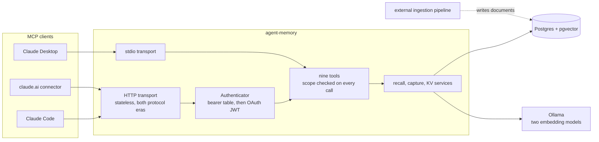
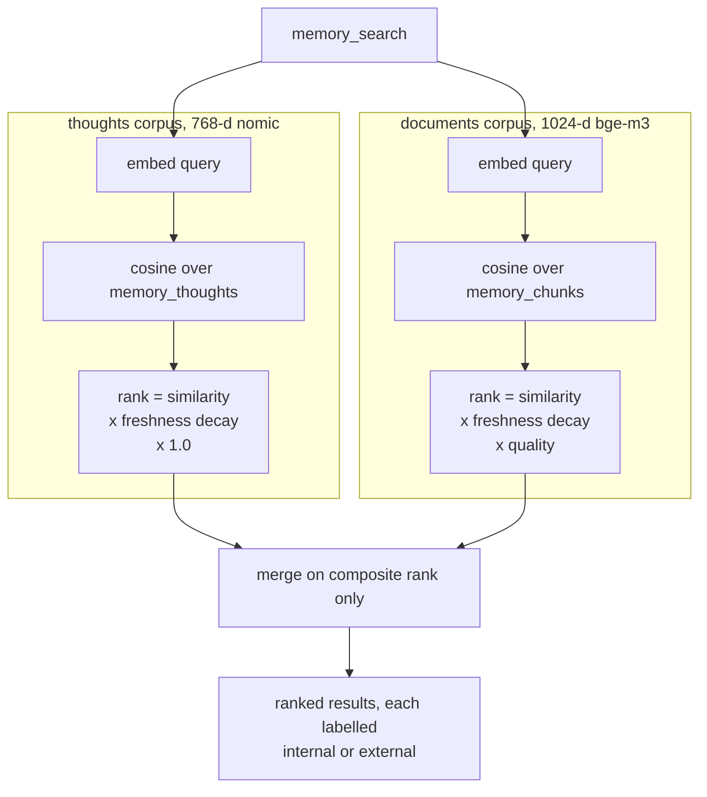
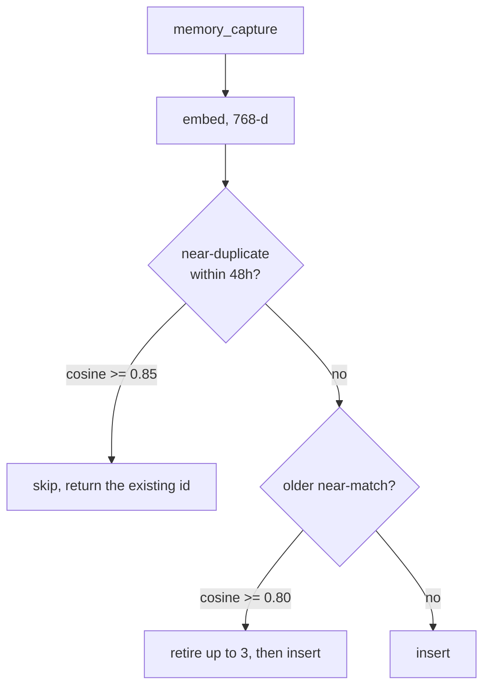
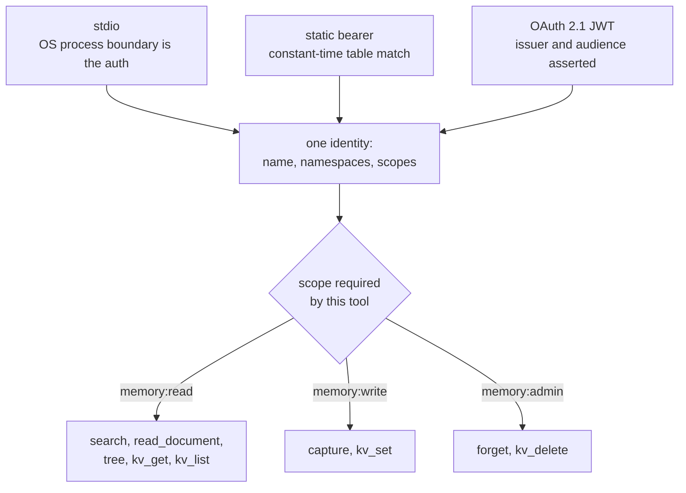

# agent-memory

Long-term memory for AI agents — an MCP server over Postgres + pgvector.

Anything an agent stores survives across sessions, machines and models; anything
it searches comes back ranked by a blend of semantic similarity, freshness and
quality.

> The repository is `agent-memory`; the server identifies itself to MCP clients
> as `rzem-memory`, which is why the config paths, environment variables and
> client alias below use that name.

## What it stores

Memory is two corpora behind one search surface:

- **Thoughts** — short, self-contained facts, decisions and observations an
  agent chooses to remember ("we chose Postgres over SQLite because...", "the
  staging API rate-limits at 100 req/min"). Stored with a semantic embedding,
  tags and a timestamp.
- **Documents** — a synced knowledge vault of longer material (mail, repository
  activity, articles, calendar entries), chunked and embedded, with an
  LLM-summarised tree of day/month/year digests over the top.

A single search sweeps both and merges the results by a composite rank, so an
agent asking "what do I know about X?" gets the best of its own notes and its
synced reading in one list, each result labelled with where it came from.

This server does no ingestion. It owns the memory tables' DDL and serves recall,
capture and KV; an external pipeline writes the documents corpus.

## Architecture



## The nine tools

No tool takes an agent id — **the credential carries the namespace**.

| Tool | Scope | What it does |
| --- | --- | --- |
| `memory_search` | `memory:read` | Semantic recall over thoughts, documents, or both merged |
| `memory_capture` | `memory:write` | Store a thought, deduplicated, superseding stale near-matches |
| `memory_forget` | `memory:admin` | Soft-delete a thought by id, namespace-guarded |
| `memory_read_document` | `memory:read` | Read a full synced document with provenance |
| `memory_tree` | `memory:read` | Browse or search the summarised day/month/year digest tree |
| `memory_kv_get` / `memory_kv_list` | `memory:read` | Durable key-value state per agent |
| `memory_kv_set` | `memory:write` | Versioned upsert; `null` is a value, not a delete |
| `memory_kv_delete` | `memory:admin` | Remove a key |

Full contracts in [docs/TECHNICAL.md](docs/TECHNICAL.md).

## Quickstart

Requires Node >= 20, PostgreSQL 16+ with pgvector 0.8+, and Ollama with
`nomic-embed-text` and `bge-m3` pulled.

```bash
npm install
npm run check                  # lint + typecheck + tests + build

cp mcp.example.toml mcp.toml   # edit; secrets stay in env, never in the TOML
npm run migrate                # creates or adopts the memory tables
npm run start:http             # 127.0.0.1:3010 by default
npm run start:stdio            # local stdio, no auth
```

Register it with Claude Code:

```bash
claude mcp add --transport http rzem-memory http://127.0.0.1:3010/mcp \
  --header "Authorization: Bearer $RZEM_MEMORY_TOKEN"
```

The nine tools then appear as `mcp__rzem-memory__*`. The token decides which
namespace you read and write — there is nothing further to configure. For a
single-user setup on the machine running the server, skip HTTP and auth
entirely:

```bash
claude mcp add --transport stdio rzem-memory -- \
  node /path/to/agent-memory/dist/stdio.js --config /path/to/mcp.toml
```

Deployment behind a reverse proxy, systemd and OAuth: [docs/DEPLOY.md](docs/DEPLOY.md).
Container deployment with a complete pgvector and Ollama stack:
[docs/DOCKER.md](docs/DOCKER.md).

## How recall works

Each corpus is searched in its own vector space and ranked there. Only the
composite rank — a dimensionless number — is ever compared across corpora.



Freshness decays on a 30-day half-life, so what surfaced last week outranks what
surfaced last year at equal relevance — while an old, highly relevant memory
still surfaces. Every result carries a taint label: `internal` for the agent's
own captures, `external` for synced content, so agents can treat synced material
as data rather than instructions.

## How capture stays clean

Agents can write freely without silting up the store. Capturing a near-duplicate
is skipped; capturing a fresher version of an old fact retires the stale one.



These thresholds are a cross-writer contract with every other process writing
the same tables. They are not tuning knobs.

## Identity and access

The token a caller presents decides which agent's memory it can touch. There is
no namespace parameter to get wrong, and no way to read another agent's memory
without a credential scoped to it.



Reads span every namespace the credential lists; writes land in its first
concrete namespace; deletes are namespace-guarded in SQL, so a thought owned by
another agent reports "not found" rather than being touched.

## Protocol support

The server speaks the current MCP specification revision (`2026-07-28`,
stateless Streamable HTTP with `server/discover`) **and** serves older clients
that still open with the classic `initialize` handshake (`2025-11-25` and
earlier) — both eras from the same endpoint, negotiated automatically. A stdio
transport is included for local single-user use.

## Documentation

- [docs/TECHNICAL.md](docs/TECHNICAL.md) — tool contracts, ranking model,
  identity model, wire behaviour, error taxonomy.
- [docs/DEPLOY.md](docs/DEPLOY.md) — requirements, configuration, systemd,
  reverse proxy, smoke tests, operational notes.
- [docs/DOCKER.md](docs/DOCKER.md) — standalone image and complete Docker
  Compose deployment with PostgreSQL/pgvector and Ollama.
- [migrations/README.md](migrations/README.md) — schema ownership and the
  adopt-don't-break migration rules.
- [CONTRIBUTING.md](CONTRIBUTING.md) — the invariants to know before changing
  anything, and what CI checks.
- [SECURITY.md](SECURITY.md) — what is in scope and how to report privately.

## Licence

[MIT](LICENSE) © 2026 Alex Rzemieniuk
