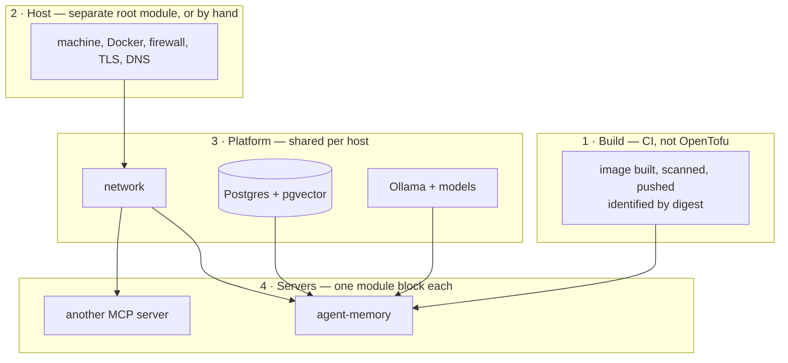
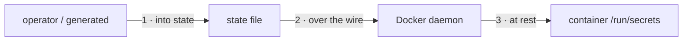
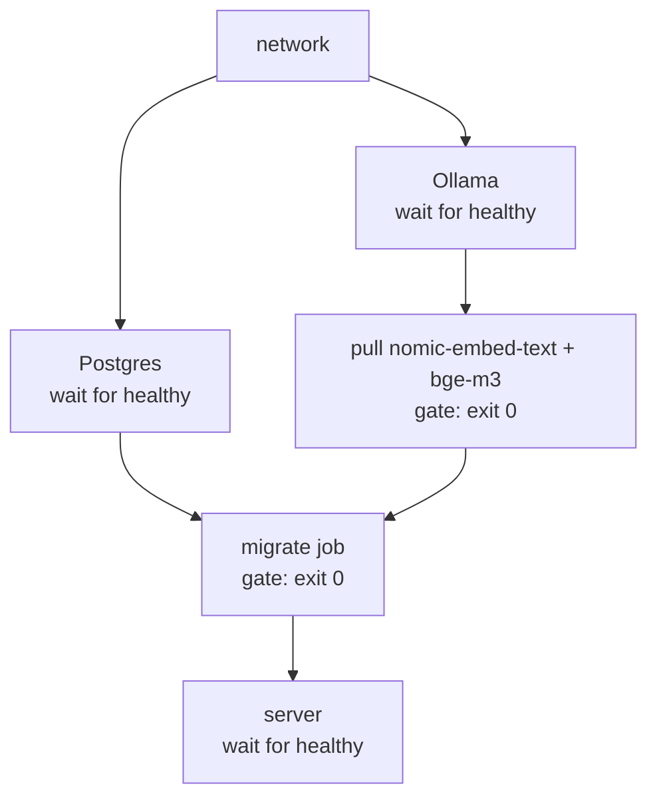

# Deploying MCP servers with OpenTofu

A strategy for putting agent-memory — and the MCP servers that come after it —
onto real hosts with a free and open source infrastructure-as-code toolchain,
and the reasoning for each decision.

The working configuration is in [terraform/](../terraform); the operator's
runbook is [terraform/README.md](../terraform/README.md). This document is the
*why*.

## The licence question, answered first

"Terraform" is no longer one thing.

| | Licence | Status |
| --- | --- | --- |
| Terraform <= 1.5.7 | MPL-2.0 | Open source, frozen since Aug 2023 |
| Terraform >= 1.6 | BUSL-1.1 | Source-available, not open source |
| **OpenTofu** | **MPL-2.0** | **Open source, Linux Foundation, actively developed** |
| HCP Terraform (Cloud) | proprietary SaaS | Not applicable |

**We use OpenTofu.** It is the fork of Terraform 1.5.7 made when HashiCorp
relicensed, it is governed under the Linux Foundation, and it takes the same
HCL, the same providers and the same state format. `tofu` substitutes for
`terraform` in every command below.

The rest of the toolchain has to clear the same bar, and does:

- `kreuzwerker/docker` — MPL-2.0
- `hashicorp/random` — MPL-2.0
- registry.opentofu.org — the open registry, no account required
- state backends — local files, or any S3-compatible store (MinIO, Garage), or
  Postgres. HCP Terraform is deliberately not in the picture.

One capability is OpenTofu-only and this design leans on it: **state
encryption**, added in OpenTofu 1.7. Terraform 1.5.7 has no equivalent, and as
the next section shows, the state file here holds credentials. If you must run
Terraform 1.5.7, everything in `terraform/` still works — you take on
protecting the state file by other means.

## What this replaces, and what it does not

The repository already ships three ways to run the server. OpenTofu does not
retire them; it sits alongside them with a different job.

| Mechanism | Job | Keep using it for |
| --- | --- | --- |
| `compose.yaml` | developer inner loop | local work, `npm run docker:up`, CI |
| `systemd/` unit | one process on one machine, no containers | bare-metal hosts, the existing single-host install |
| **`terraform/`** | **declared, versioned, reproducible deployments** | **anything you have to repeat, hand over, or audit** |

The dividing line is repeatability. Compose is a good description of a stack
and a poor description of a *deployment*: it has no state, no plan step, no
record of what is actually running, and no way to say "these three hosts, these
digests, these tokens". That is exactly the gap OpenTofu fills.

The cost is a second description of the same topology. Compose and OpenTofu can
drift. Two things keep that in check: the image is built once and referenced by
digest from both, and the config file is generated from the same shape in both.
When you change one, check the other — they are listed together in
[CONTRIBUTING.md](../CONTRIBUTING.md).

## Four layers, and where the boundary is



**Layer 1 stays out of OpenTofu.** The Docker provider *can* build images. It
should not here: a build makes the apply depend on a source tree, so the same
config produces different results on different machines, and the plan can no
longer tell you what will actually run. CI builds, Trivy scans, the registry
stores, and the digest is the contract. A deploy is a digest change and nothing
else.

**Layer 2 is pluggable.** On a homelab box or an existing VPS it is already
done. On a cloud host it becomes a second root module — Hetzner, DigitalOcean,
Proxmox — that outputs an SSH target the stack in layer 3 consumes. Splitting
it matters because the layers have wildly different change rates: the host
changes yearly, the digest weekly.

**Layer 3 is shared.** One Postgres and one Ollama serve every MCP server on
the host. Ollama in particular is expensive to duplicate — several GB of model
weights and a warm cache.

**Layer 4 is where servers plug in.** Adding one is a module block.

## The contract a server has to meet

The `mcp-server` module knows nothing about memory, corpora or embeddings. It
assumes four things, which is what makes it reusable:

1. **One image, one foreground process.** No supervisor, no sidecar.
2. **Configured by a file at a known path, with secrets referenced *from* that
   file rather than embedded in it.** agent-memory's `{ file = "/run/secrets/..." }`
   secret refs are exactly this shape.
3. **A health check that means "serving".** From the image's `HEALTHCHECK` or
   passed to the module.
4. **Optionally, a one-shot command that must succeed first** — migrate, seed,
   warm — runnable from the same image with the same config.

agent-memory satisfies all four already, which is the point: the contract was
read off a well-built server, not imposed on one.

A server that only takes configuration through environment variables still
works (`env`), but it gives up the main benefit of point 2 — that the rendered
config is fully visible in `tofu plan` while the secrets stay redacted, because
the config contains only *references* to them.

## Secrets: three hops, three different problems



**Hop 1 — state.** OpenTofu generates the database password and one bearer
token per client, so standing a stack up never requires inventing and
hand-placing credentials. The unavoidable consequence is that they are in the
state file. So the state file is encrypted:

```bash
export TF_ENCRYPTION='key_provider "pbkdf2" "main" { passphrase = "…" }
method "aes_gcm" "main" { keys = key_provider.pbkdf2.main }
state { method = method.aes_gcm.main }'
```

It goes in the environment rather than in the config because OpenTofu evaluates
the `encryption` block before variables exist — `passphrase = var.x` is a hard
error. With it set, the state file's `encrypted_data` is AES-GCM ciphertext
and the credentials do not appear in it in plaintext. For a team, swap the
pbkdf2 passphrase for the OpenBao key provider (itself the MPL-licensed fork of
Vault) and the whole chain stays open source.

A saved plan file (`tofu plan -out=…`) holds the same values in cleartext and
is *not* covered by state encryption — treat one like a state file, or do not
save it. `.gitignore` covers `*.tfplan` for the obvious accident.

If a secret must never enter state at all, put the file on the host out of band
and mount it: `bind_mounts` instead of `secret_files`. That is the right answer
for a credential you did not generate and cannot rotate, at the cost of
something outside OpenTofu having to put it there.

**Hop 2 — the wire.** Never expose the Docker daemon on a TCP port for this.
`docker_host = "ssh://deploy@host"` tunnels over SSH, so the daemon socket
stays local to the host and the SSH key becomes the deployment credential.

**Hop 3 — at rest in the container.** Files are uploaded to `/run/secrets/…`
before the container starts, mode `0444`. Not `0400`: uploads land owned by
root, the image drops to an unprivileged user, and a root-owned `0400` file is
one the application cannot read. Inside a single-process container the file
mode is not the security boundary — the container is. If that trade is
unacceptable, use a host bind mount, where you control ownership.

What is deliberately *not* used: environment variables for secrets. They are
visible to anything that can inspect the container, they leak into crash
dumps, and the application already prefers file refs.

## Ordering, and why the apply can fail usefully



Each edge is enforced, not hoped for:

- Containers with a health check are created with `wait = true`, so the
  resource is not complete until the thing is actually answering.
- One-shot jobs run attached, and a `postcondition` asserts `exit_code == 0`.
  A failed migration fails the *apply*. Without that, OpenTofu would report
  success and leave a healthy-looking server pointed at an unmigrated database
  — a failure the application cannot detect, because a search against missing
  tables is an error and a search against an empty one is silence.
- The model pull is a gate for the same reason. The two corpora live in a 768-d
  and a 1024-d vector space and the column widths are fixed; a missing or
  wrong-width model makes recall return nothing rather than fail.

### The redeploy trigger

`image`, `command`, `env` and every uploaded file are `ForceNew` in the Docker
provider. So changing the image digest **or** any byte of rendered config
replaces the container — and, because the migrate job shares both, re-runs
migrations first. There is no separate "restart" verb to remember and no way to
change config without the change taking effect.

### Migrations stay the application's job

There is no `postgresql` provider here, and there will not be one.
[migrations/README.md](../migrations/README.md) makes this repository the
single owner of every `memory_*` relation, with idempotent, adopt-don't-break
files. Modelling those tables in HCL would make OpenTofu a second declarative
writer of the same DDL — precisely the drift the ownership rule exists to
prevent, and worse than the original problem because Terraform would try to
*converge* the schema on every apply.

The module therefore calls the owned runner (`node dist/cli/migrate.js`) and
does exactly one thing with the result: fails if it is non-zero. That
generalises — for any MCP server, invoke its own bootstrap tooling, do not
reimplement it.

## Rollout path

Four steps, each independently useful, none requiring the next.

**1 · Validate in CI (done).** `tofu fmt -check`, `init -backend=false`,
`validate` on every module and stack. No daemon, no credentials, no cost. The
HCL cannot rot silently.

**2 · Adopt the existing deployment.** Import the existing data volumes so
OpenTofu takes over a running stack without recreating it, and carry the
current credentials across — the database password because an initialised
cluster will not accept a new one, the bearer token so clients need no
reconfiguration during the cutover. The volumes
carry `prevent_destroy`, so the rollback is a container-targeted destroy
followed by `docker compose up -d`, with the data untouched. Procedure in
[terraform/README.md](../terraform/README.md#adopting-an-existing-compose-deployment).

**3 · Move the daemon remote.** Change `docker_host` to an `ssh://` URL. The
configuration is otherwise identical, which is the test of whether the split
between layers 2 and 3 was drawn correctly.

**4 · Add the second server.** The first one to arrive proves the module
generic or exposes what is still agent-memory-shaped in it. Fix it there rather
than forking the module.

## What this approach is bad at

Stated plainly, because choosing it means accepting these.

- **No rolling deploys.** A config change stops the container and starts a new
  one — seconds of downtime. Acceptable here specifically because clients are
  told to treat a down memory server as "no memory this turn" rather than an
  error. A server without that property needs a proxy doing connection draining,
  or a real orchestrator.
- **Apply blocks on jobs.** The model pull downloads gigabytes with the apply
  waiting on it. Fine for a deploy, wrong for anything long — run bulk
  backfills outside OpenTofu.
- **Drift is only skin-deep.** OpenTofu compares container metadata: image,
  ports, labels, mounts. It cannot see that someone `docker exec`'d a change
  into a running container. Containers are cattle; if you suspect it, replace it.
- **One host per stack.** Two hosts is two state files, or a `for_each` over
  provider aliases, both of which get awkward past a handful. The threshold for
  moving to Nomad or Kubernetes is roughly: more hosts than you can name, or a
  server that genuinely cannot take a restart. Layers 1, 3 and 4 survive that
  move — the module is replaced, the contract is not.
- **Secrets are in state.** Mitigated, not eliminated. See hop 1.
- **Not every credential rotates declaratively.** Bearer tokens do — they are
  read from a file at every boot, so replacing the value and applying is the
  whole procedure. The database password does not: Postgres reads
  `POSTGRES_PASSWORD_FILE` when `initdb` creates the cluster and ignores it
  ever after, so a new value in the config is a value the database has never
  heard of. Rotating it is an `ALTER ROLE` first, then an apply. This asymmetry
  is worth checking for on any new dependency you add — "does this container
  re-read its credential on restart?" is the question.

## What is deliberately absent

- **TLS.** The endpoint publishes to loopback. Bearer tokens over plain HTTP
  must not leave the machine, and terminating TLS belongs to the reverse proxy
  in layer 2 — where the certificates, the hostname and the renewal already
  live. [docs/DEPLOY.md](DEPLOY.md) has the nginx configuration, including the
  `proxy_buffering off` that streamed responses need.
- **Backups.** `pg_dump` on a schedule is a systemd timer or a cron job, not a
  resource graph. OpenTofu's contribution is naming the volume that matters and
  refusing to destroy it.
- **Monitoring.** Same reasoning. `/health` and the JSON logs are the surface;
  what scrapes them is a separate concern.

Each of these could be pulled in later. None of them should be pulled in
because the tool happens to be open.
